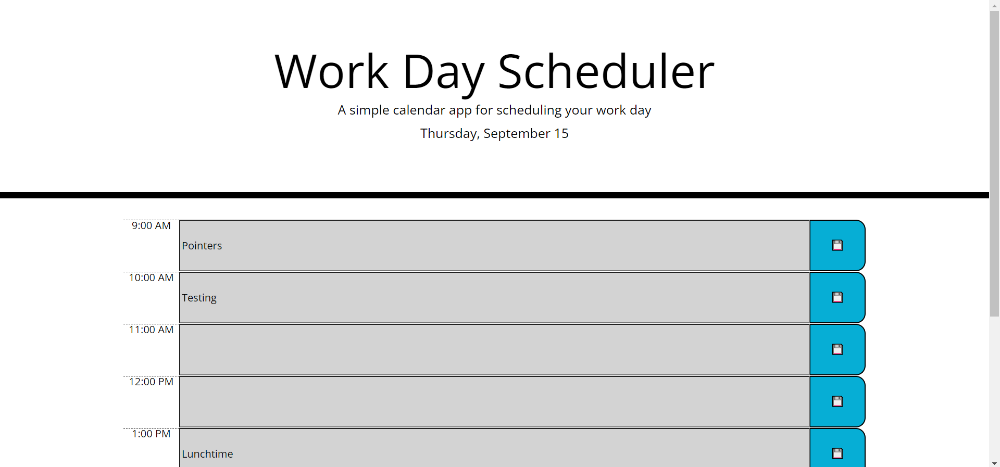

# Work-Day-Scheduler
A website to help plan one's work schedule with by saving events in a calender.

Today's date will be displayed on the top of the screen, and a schedule will be displayed below. Depending on the time of day, the schedule will change color to reflect the current time of day.

Events can be inputted into the time blocks within the schedule, and pressing the save icons to the right will save the current schedule.

# Screenshots

# Link to the website

https://ultrapyre.github.io/Work-Day-Scheduler/